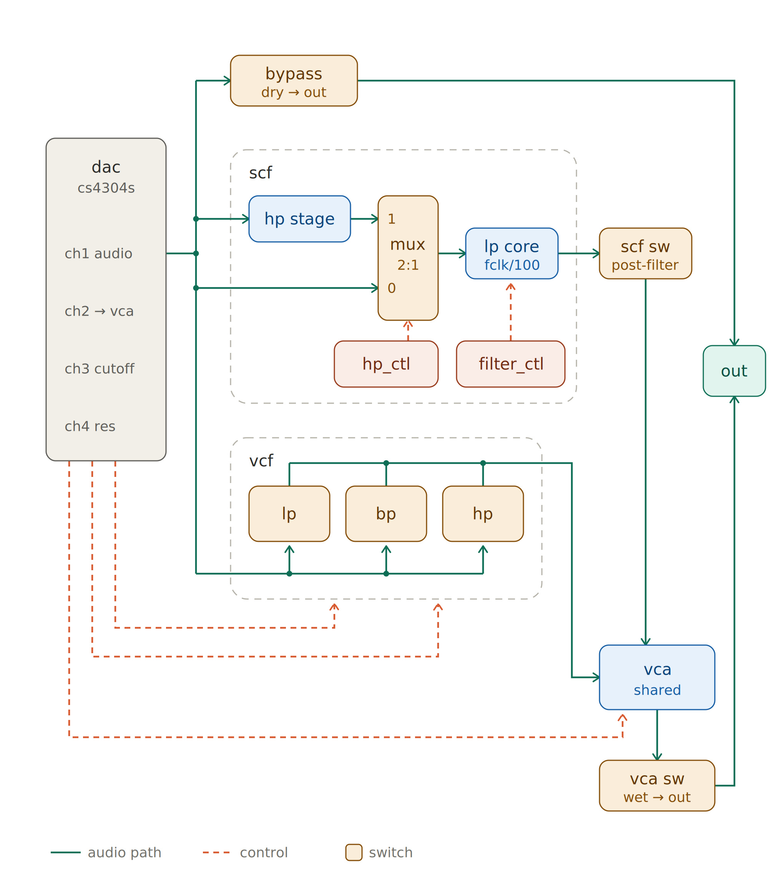

# Channel Card — Firmware

> **Start with [`../../README.md`](../../README.md)** — toolchain setup, build
> commands, DFU flashing and the STM32CubeMX regeneration rules are
> common to both cards and documented there.

|                |                                                   |
| -------------- | ------------------------------------------------- |
| MCU            | STM32H725xG                                       |
| CMake target   | `channel_MCU`                                     |
| CubeMX project | `channel_MCU.ioc`                                 |
| Linker script  | `STM32H725xG_flash.ld`                            |
| USB stack      | TinyUSB 0.17 (`ThirdParty/tinyusb`)               |
| USB device     | UAC2 speaker (mono, 32-bit, 96 kHz) + CDC console |
| RS485 address  | `c:`                                              |

## What this card does

Receives USB audio from the PC and plays it out of a **CS4304 4-channel
DAC** over I2S, while generating independent test signals on the other
channels.

- **CH1** — USB audio playback from the host
- **CH2–CH4** — firmware-generated sine tones or DC levels (console
  controlled), clocked purely by I2S with no USB involvement
- Console over RS485 (`c:` prefix) and USB CDC

## Audio signal path



Green = audio, dashed red = control, tan boxes = analog switches driven
by GPIO. Every tan box maps to one name in the `sw` console command.

### DAC channel roles

The CS4304S is one 4-channel DAC doing two different jobs — **one audio
channel and three control voltages**:

| DAC ch | Role                                                          | Set with                             |
| ------ | ------------------------------------------------------------- | ------------------------------------ |
| CH1    | **Audio** — the USB playback signal, or an internal test tone | host volume / `gain 1`, `tone1 <Hz>` |
| CH2    | **CV → VCA** gain                                             | `dc 2 <-100..100>`                   |
| CH3    | **CV → VCF cutoff**                                           | `dc 3 <-100..100>`                   |
| CH4    | **CV → VCF resonance**                                        | `dc 4 <-100..100>`                   |

So CH2–CH4 are not heard directly: they steer the analog blocks. (They
can also emit tones via `freq` for testing the CV lines themselves.)

### The two output routes

Audio from CH1 reaches the output by either — or both — of:

- **Dry:** `bypass` switch → straight to `out`
- **Wet:** through SCF and/or VCF → **VCA** → `vca` switch → `out`

For bring-up/verification with no PC attached, `tone1 <Hz>` swaps CH1's
source from USB to an internal 128-entry sine generator (see
`audio_bridge.c`); combine with `sw bypass on` to hear a clean, filter-free
sine directly at `out`. `tone1 0` restores the normal USB source.

### Switch reference

| `sw` name | Diagram block        | Function                                 | Polarity        |
| --------- | -------------------- | ---------------------------------------- | --------------- |
| `bypass`  | bypass (dry → out)   | Route unprocessed CH1 to the output      | active-low      |
| `scf`     | scf sw (post-filter) | Pass the SCF output on to the VCA        | active-low      |
| `hp_ctl`  | mux 2:1 select       | SCF input: HP stage (on) or direct (off) | **active-high** |
| `vcf`     | vcf path enable      | Feed CH1 into the VCF block              | active-low      |
| `lp`      | vcf → lp             | Take the VCF **low-pass** tap            | active-low      |
| `bp`      | vcf → bp             | Take the VCF **band-pass** tap           | active-low      |
| `hp`      | vcf → hp             | Take the VCF **high-pass** tap           | active-low      |
| `vca`     | vca sw (wet → out)   | Route the VCA (wet) output to `out`      | active-low      |

`hp_ctl` is the one **active-high** switch — see the `switches[]` table
in `main.c`, where its `active_low` field is `0` while every other entry
is `1`. `sw <name> on` handles the polarity for you; it matters only if
you drive the GPIO directly.

The VCF taps (`lp`/`bp`/`hp`) are separate switches, not a selector —
enabling more than one sums those responses into the VCA.

### SCF clock

The SCF's `lp core` cutoff is **clock ÷ 100**, so:

```
scf 100      → 100 kHz clock → 1 kHz cutoff
```

| Command         | Action                                              |
| --------------- | --------------------------------------------------- |
| `scf <1..2000>` | SCF clock in kHz (`0` = off) — this is `filter_ctl` |
| `duty <1..99>`  | SCF clock duty cycle % (default 50)                 |

## CPU load probe (yellow LED)

**What you do**

1. Flash the Channel Card build.
2. On RS485/USB console: `cpuload on` or `cpuload on 4` (voice count).
3. Probe the **yellow LED** pin — **PB9 / `LED_Y`** (not the red LED).
4. On the scope: **low = CPU busy**, **high = idle**.
5. `CPU% ≈ t_low / (t_low + t_high)`.
6. When done: `cpuload off`.

Smoke after console extract / flash: `cpuload 1`, `cpuload 16`, `cpuload off`,
`n0 440 0.5`, `gain 1 0` — LED chaser should resume after `cpuload off`.

`cpuload on` / bare `cpuload` starts **16** oscillators (220, 260, … Hz). Pass
**`1..16`** to change how many run — busy % should rise roughly with count
(e.g. `cpuload 1` then `cpuload 16` on the scope).

| Command | Action |
|---|---|
| `cpuload` / `cpuload on` | 16 voices + DMA LED probe |
| `cpuload on 4` / `cpuload 4` | 4 voices only (compare duty cycle) |
| `cpuload queue 8` | 8 voices + soft-queue LED probe |
| `cpuload off` | Clear notes, stop probe, resume LED chaser |

## Build & flash

```bash
cmake --preset Debug
```

```bash
cmake --build build/Debug
```

Then flash `build/Debug/channel_MCU.hex` over DFU — see
[`../../README.md`](../../README.md) §3.

## Source map

| Path                      | Contents                                                                     |
| ------------------------- | ---------------------------------------------------------------------------- |
| `Core/Src/main.c`         | Bring-up, DAC init, main loop wiring                                         |
| `Core/Src/channel_console.c` | RS485 + USB CDC console, `cpuload`, LED chaser                            |
| `Core/Src/uart5_rx.c`     | Interrupt-driven UART5 RX ring buffer feeding the RS485 console               |
| `Core/Src/audio_bridge.c` | **USB→I2S audio engine** — ring buffer, tone/DC generators, I2S2 workarounds |
| `Core/Src/cs4304.c`       | CS4304 DAC driver (I2C)                                                      |
| `Core/Src/note_bank.c`    | N0–NF additive sine bank                                                     |
| `USB_APP/`                | TinyUSB descriptors, `tusb_config.h`, UAC2 + CDC glue                        |

### `audio_bridge.c` — handle with care

This file holds the tuned playback path and its behaviour was
hard-won on hardware. Notable parts, all commented in-place:

- **USB→I2S ring buffer** with a write pointer deliberately started half
  a buffer ahead of the DMA read point, plus a drift guard that
  re-centres it. Writing per-DMA-half instead caused continuous
  glitching.
- **I2S start order matters** — the I2S1 master must be running before
  the I2S2 slave is enabled, or the slave never shifts.
- **I2S2 slave workarounds** — UDR wedge clearing via the TIM7 pump, and
  `CFG2.IOSWP` to swap MISO/MOSI because the board wires PC1 to the
  DAC's SDIN2.
- **DMA buffers live in AXI SRAM** (`.dma_buffer` section) — DMA1 cannot
  reach the DTCM RAM where `.bss` normally lands.

It was relocated out of `USB_DEVICE/App/usbd_audio_if.c` when the card
moved from ST's USB Device Library to TinyUSB; only the ~30 lines that
touched ST's stack were changed.

## Volume behaviour (worth knowing)

The device advertises a **mute-only** UAC2 feature unit, so **Windows
applies volume in software** by scaling the PCM before sending it. The
firmware passes samples through at unity and only gates to silence on
mute.

This is deliberate: advertising a hardware volume control made Windows
push one value at enumeration and then never update it, leaving the
device stuck at a stale attenuation. Do not re-add a volume control
without re-testing the full slider range on Windows.

**`N0`** applies **bypass ON** and **`gain 1 0`** (0 dB CH1 DAC trim) at
boot and on bare `n0`. **`N0`…`NF`** are 16 independent phase-accumulator
sines summed onto CH1. Optional **`[scale]`** (0.0..1.0, default **1.0**) sets
that note’s amplitude. Frequency/scale changes do not touch gain or bypass.
**`gain`** changes DAC atten on any channel.

## Console quick reference

| Command | Action |
|---|---|
| `N0` | Session defaults: bypass on, gain 1 0 |
| `N0`…`NF` `0` | Turn that note off (gain/bypass unchanged) |
| `N0`…`NF` `<Hz>` | Note at Hz, scale **1.0** (max); voices sum on CH1 |
| `N0`…`NF` `<Hz> <scale>` | Note at Hz with amplitude 0.0..1.0 (e.g. `n0 440 0.5`) |
| `gain <ch> <dB>` | DAC atten 0..127 on ch 1..4 (e.g. `gain 1 40`) |
| `cpuload` / `on` `[1..16]` | N voices + LED_Y (PB9) DMA load probe (default 16) |
| `cpuload queue` `[1..16]` | Same, soft-queue producer mode |
| `cpuload off` | Clear notes; resume LED chaser |
