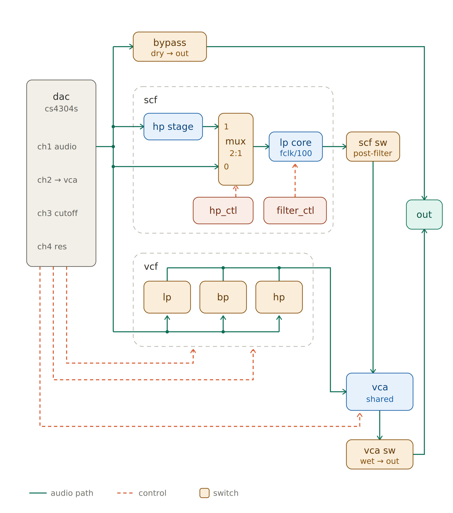

# Channel Card — Firmware

Standalone checkouts (SVN trunk) ship the toolchain handbook as
[`docs/firmware_handbook.md`](docs/firmware_handbook.md) and the wire
contract as [`docs/protocol.md`](docs/protocol.md). In the git monorepo
those same files live at the repository root (`README.md`,
[`docs/protocol.md`](docs/protocol.md) here and
[`../docs/protocol.md`](../docs/protocol.md)).

|                |                                                              |
| -------------- | ------------------------------------------------------------ |
| MCU            | STM32H725xG                                                  |
| CMake target   | `channel_MCU`                                                |
| CubeMX project | `channel_MCU.ioc`                                            |
| Linker script  | `STM32H725xG_flash.ld`                                       |
| USB stack      | Custom CDC over STM32 HAL PCD                          |
| USB device     | One binary CDC port: BODY + uploads             |
| RS485 address  | `c:`                                                         |

Each board exposes a stable USB serial number derived from its 96-bit STM32
hardware UID: `CHCARD-<24 hex digits>`. On macOS, the CDC path therefore looks
like `/dev/cu.usbmodemCHCARD_<24 hex digits>...`; the OS chooses the suffix.
The new CDC-only descriptor can change that suffix. Flashing preserves the UID.

## Build artifacts

Each firmware link produces `channel_MCU.bin` plus a timestamped copy such as
`channel_MCU_20260917_142245.bin`. The timestamp uses the build computer's local
timezone. Both binaries contain identical firmware. A matching `.json` records
the SHA-256 checksum, size, build profile, compiler version and RS485 baud rate.
Use `./scripts/fw build channel --release` from the repository root for a Release
build. No Git revision is added to the filename.

## What this card does

Receives sample blocks from the PC over USB CDC into **per-voice sustain rings**, and
plays the 8-voice SAMPLE / note bank out of a **CS4304 4-channel DAC**
over I2S.

- **CH1** — SAMPLE note-bank mix (`n0..n7`). Binary CDC BODY transport fills the
  per-voice rings used for sustain. Berry may append oscillators sourced from
  eight looping wavetables reserved at attack-bank IDs 248…255.
- **CH2–CH4** — firmware-generated DC control voltages, clocked purely
  by I2S with no USB involvement (0 V at boot)
- Text console over RS485 (`c:` prefix); USB is binary-only

The note bank has no firmware-owned envelope policy. After each reset, upload a
valid Channel Berry ABI2 program with `cmi::Core` before sending note commands.
Until then the card stays silent and replies `err:no-program`.

### USB streaming

For the message header, packet types, annotated hex examples and note sequence,
see the [USB packet guide](docs/usb_packet_guide.md).

Debug, Release, and host integration tests all use the same production SAMPLE
path: signed-int8 attacks plus USB BODY streaming. Each voice has one contiguous
4,080-sample DTCM ring (85 ms at 48 kHz). This is the only Channel audio build
profile.

## Audio signal path

Firmware / USB / playhead / I2S (including ISR vs main loop):
[`docs/diagrams/card_data_flow.md`](docs/diagrams/card_data_flow.md).

Analog wet/dry and GPIO switches:



Green = audio, dashed red = control, tan boxes = analog switches driven
by GPIO. Every tan box maps to one entry in the `switches[]` table in
`Core/Src/console/channel_console.c` (boot defaults; no runtime command).

### DAC channel roles

The CS4304S is one 4-channel DAC doing two different jobs — **one audio
channel and three control voltages**:

| DAC ch | Role                                                | Set with                              |
| ------ | --------------------------------------------------- | ------------------------------------- |
| CH1    | **Audio** — SAMPLE note-bank mix (`n0..n7`)         | `g 1 <dB>`                            |
| CH2    | **CV → VCA** gain                                   | `Audio_SetDCLevel(2, …)` (boot: 0 V)  |
| CH3    | **CV → VCF cutoff**                                 | `Audio_SetDCLevel(3, …)` (boot: 0 V)  |
| CH4    | **CV → VCF resonance**                              | `Audio_SetDCLevel(4, …)` (boot: 0 V)  |

So CH2–CH4 are not heard directly: they steer the analog blocks. The
CV levels are driven through `audio_tone_dc.c` (per-channel zero
calibration, slew limiting); there is currently no console command for
them — firmware sets 0 V at boot.

### The two output routes

Audio from CH1 reaches the output by either — or both — of:

- **Dry:** `bypass` switch → straight to `out`
- **Wet:** through SCF and/or VCF → **VCA** → `vca` switch → `out`

For bring-up/verification, first upload a Channel VM program to voice 0, then
use the note bank: `n0 on 69` plays A4 onto CH1 with the default tuning. Bypass
is enabled at boot, so the tone is heard clean and filter-free at `out`.
`n off` silences all voices.

### Switch reference

| Switch    | Diagram block        | Function                                  | Polarity        |
| --------- | -------------------- | ----------------------------------------- | --------------- |
| `bypass`  | bypass (dry → out)   | Route unprocessed CH1 to the output      | active-low      |
| `scf`     | scf sw (post-filter) | Pass the SCF output on to the VCA        | active-low      |
| `hp_ctl`  | mux 2:1 select       | SCF input: HP stage (on) or direct (off) | **active-high** |
| `vcf`     | vcf path enable      | Feed CH1 into the VCF block              | active-low      |
| `lp`      | vcf → lp             | Take the VCF **low-pass** tap            | active-low      |
| `bp`      | vcf → bp             | Take the VCF **band-pass** tap           | active-low      |
| `hp`      | vcf → hp             | Take the VCF **high-pass** tap           | active-low      |
| `vca`     | vca sw (wet → out)   | Route the VCA (wet) output to `out`      | active-low      |

`hp_ctl` is the one **active-high** switch — see the `switches[]` table
in `Core/Src/console/channel_console.c`, where its `active_low` field is
`0` while every other entry is `1`. All switches are driven OFF at init,
then the boot defaults turn `bypass` ON; the polarity only matters if
you drive the GPIOs directly.

The VCF taps (`lp`/`bp`/`hp`) are separate switches, not a selector —
enabling more than one sums those responses into the VCA.

### SCF clock

The SCF's `lp core` cutoff is **clock ÷ 100** (a 100 kHz clock gives a
1 kHz cutoff). The clock line is `filter_ctl` (TIM3_CH1, PC6); firmware
holds it LOW at boot and exposes no console control for it.

## Build & flash

```bash
cmake --preset Debug
```

```bash
cmake --build build/Debug
```

Then flash `build/Debug/channel_MCU.hex` over DFU — see
[`docs/firmware_handbook.md`](docs/firmware_handbook.md) in an SVN
checkout, or [`../README.md`](../README.md) §3 in the git monorepo.

## Source map

Hand-written modules live under `Core/Src/<domain>/` (and matching
`Core/Inc/<domain>/`). CubeMX-generated files stay flat in `Core/Src` /
`Core/Inc`.

| Path                                       | Contents                                                          |
| ------------------------------------------ | ----------------------------------------------------------------- |
| `Core/Src/main.c`                          | Bring-up, DAC init, main loop wiring                              |
| `Core/Src/console/channel_console.c`       | RS485 + USB CDC console and LED status                            |
| `Core/Src/console/uart5_rx.c`              | Interrupt-driven UART5 RX ring buffer                             |
| `Core/Src/audio/audio_bridge.c`            | USB → per-voice stream rings; CH1 note-bank mix; I2S DMA |
| `Core/Src/audio/note_bank.c`               | n0–n7 8-voice attack/BODY SAMPLE bank                             |
| `Core/Src/filters/note_filter.c`           | Per-voice LPF wrapper (base/effective cutoff, pitch-k, q/Q31)     |
| `Core/Src/filters/butterworth_four_pole.c` | Reusable 4-pole DF4 Butterworth kernel                            |
| `Core/Src/drivers/cs4304.c`                | CS4304 DAC driver (I2C)                                           |
| `USB_APP/`                                 | Custom USB CDC device, binary BODY + uploads                    |

### `audio_bridge.c` — handle with care

This file holds the playback path as measured on the board. Notable
parts, all commented in-place:

- **BODY stream** uses custom CDC bulk reception. The USB interrupt rearms
  64-byte receives into an 8 KB queue; main parses variable blocks up to 1024
  samples. A full USB queue NAKs rather than discarding bytes. RS485 `vq`
  supplies credit and five-ms demand forecasts. Early BODY blocks wait for
  ring space; framing faults stop the transport and require reconnect. USB traffic does not clock the DAC.
  See [qualification and limits](docs/cdc_validation.md).
- **I2S start order matters** — the I2S1 master must be running before
  the I2S2 slave is enabled, or the slave never shifts.
- **I2S2 slave workarounds** — UDR wedge clearing via the TIM7 pump, and
  `CFG2.IOSWP` to swap MISO/MOSI because the board wires PC1 to the
  DAC's SDIN2.
- **DMA buffers live in AXI SRAM** (`.dma_buffer` section) — DMA1 cannot
  reach the DTCM RAM where `.bss` normally lands.

## Volume control

There is no USB speaker volume control. BODY samples pass at unity.
Use **`g <ch> <dB>`** for CS4304 DAC trim.

The card applies **bypass ON** and **`g 1 0`** (0 dB CH1 DAC trim) at
boot. **`n0`…`n7`** are eight independent sample voices summed
onto CH1. Their uploaded scripts control tuning and amplitude. Production
firmware has no internal oscillator; playback requires loaded attack/BODY
sample data. `g` changes DAC attenuation on any channel.

## Console command reference

This table matches the parser in
`Core/Src/console/channel_console.c`. Commands are case-insensitive because
console input is converted to lowercase. End a command with carriage return.

On shared RS485, prefix commands with `c:`. Replies are tagged `[C]`.
The Channel USB port accepts only framed binary blocks.
Successful setters normally return `ok`. Common failures are `err:syntax`,
`err:range`, `err:unknown`, `err:no-program`, and `err:vm-busy`.

### Playback and card control

| Command | Action |
| ------- | ------ |
| `h` / `help` / `?` | Return the live command list. |
| `n0`…`n7 on <key> [velocity]` | Start voice 0…7 using MIDI key 0…127 and velocity 1…127; velocity defaults to 127. A valid script must already be loaded for that voice. |
| `n0`…`n7 on <key> <velocity> @<session>` | Start a streamed note and bind BODY session 0…254 before acknowledging. Key-only commands default to velocity 127. |
| `n0`…`n7 off` | Release one voice. |
| `n off` | Release all eight voices. |
| `g <channel> <dB>` | Set CS4304 attenuation: channel 1…4, attenuation 0…127 dB. |

### Filters

| Command | Action |
| ------- | ------ |
| `f` | Query effective cutoff, q, and pitch tracking for voices 0…7. |
| `f <Hz> [q]` | Set every voice's base cutoff. Range is 20…20000 Hz; `0` and `20000` bypass. Optional q is 0.5…10. |
| `f0`…`f7` | Query one voice's filter. |
| `f0`…`f7 <Hz> [q]` | Set one voice's base cutoff and optionally q. |
| `fk` | Query pitch tracking for every voice. |
| `fk <k>` | Set pitch tracking for every voice; k range 0…10. |
| `fk0`…`fk7` | Query one voice's pitch tracking. |
| `fk0`…`fk7 <k>` | Set one voice's pitch tracking. |

Pitch tracking uses `fc = fbase × (noteHz / 261.625565)^k`. See
[`docs/reference/note_filter_butterworth.md`](docs/reference/note_filter_butterworth.md).

### Samples, scripts, and streaming

| Command | Transport | Action |
| ------- | --------- | ------ |
| Upload kind 1 | Binary USB | Upload sample attack ID 0…247 using 1…512 signed-int8 bytes. |
| Upload kind 2 | Binary USB | Upload logical oscillator wave 0…7 using 2…512 signed-int8 bytes. Firmware owns its physical bank placement. |
| `ar <id> <Hz>` | RS485 | Set the positive root frequency for attack ID 0…255. |
| `aw <voice> <id>` | RS485 | Assign sample attack ID 0…247 to voice 0…7. IDs 248…255 are reserved wavetables. |
| `a` | RS485 | Query loaded attack count and the 256-bit loaded mask. |
| Upload kind 3 | Binary USB | Begin an FWSC ABI2 program upload to voice 0…7. Total container size is 20…16404 bytes. Send offset-checked chunks; the final reply confirms validation/commit. |
| `vm` | RS485 | Query the active-program voice mask. |
| `vm <voice>` | RS485 | Query active state, target, ABI version, and fault for voice 0…7. |
| `vm mem` | RS485 | Return shared VM arena and per-voice fault/cycle diagnostics. |
| `vq` | RS485 | Query active/pending masks, BODY sessions, target fill, and exact writable credit. RS485 uses the fixed 61-byte `vq` response. |
| `reset` | RS485 | Clear RS485 hardware RX FIFO, queued RX bytes, receive error flags, and partial command line; replies `ok:reset`. Does not reboot or clear audio/voice state. |
| `usb` | RS485 | Query BODY transport and underrun counters. |
| `usb 0` | RS485 | Clear BODY transport counters and return the new values. |
| `cpuload [0\|1]` | RS485 | Query or enable the LED_Y DMA-refill scope probe. Low is busy; high is idle. |

Send `c:reset\r` and wait for `ok:reset` before sending another RS485 command:
bytes already queued behind reset are discarded. The command must reach a
working console; it cannot reset the host adapter or recover a disconnected bus.
Lifetime RX-drop counters are preserved.

The former ASCII `al`, `wl`, and `vmload` USB operations are replaced by
binary upload kinds 1, 2, and 3. BODY blocks can be interleaved with upload chunks.
Full upload sequencing and reply fields are documented in
[`../docs/protocol.md`](../docs/protocol.md).

### Service diagnostics

| Command | Action |
| ------- | ------ |

`vm mem`, `usb`, and `cpuload` are service diagnostics;
applications should use the high-level `cmi::Core` operations instead.

With `cpuload 1`, LED_Y/PB9 goes low on entry to each SPI1 DMA half-buffer
callback and high after its 48-frame refill completes. At 48 kHz the period is
1 ms, so scope duty cycle is `low_time / 1 ms`. The pulse includes USB callback
work, pending Berry handlers, and sample/oscillator/filter/envelope mixing.
Use `cpuload 0` to return the fixed LEDs to normal operation.

Pitch-track smoke with a loaded sample: `f0 300`, `fk0 1`, `n0 on 60` then
`n0 on 72` — corner should roughly double with the octave (query `f0`).
