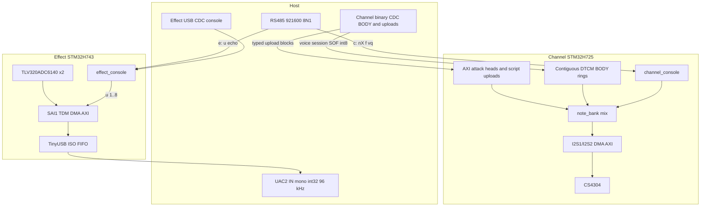
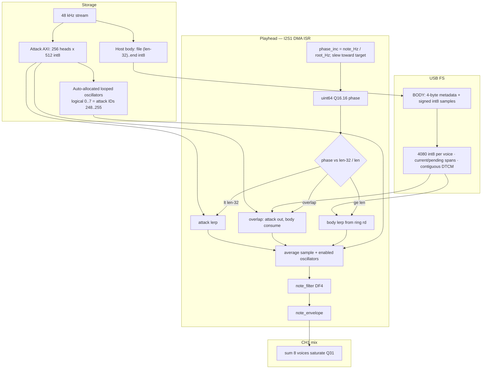
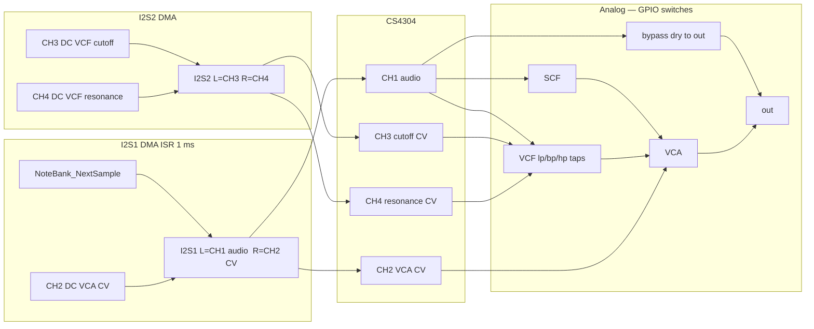
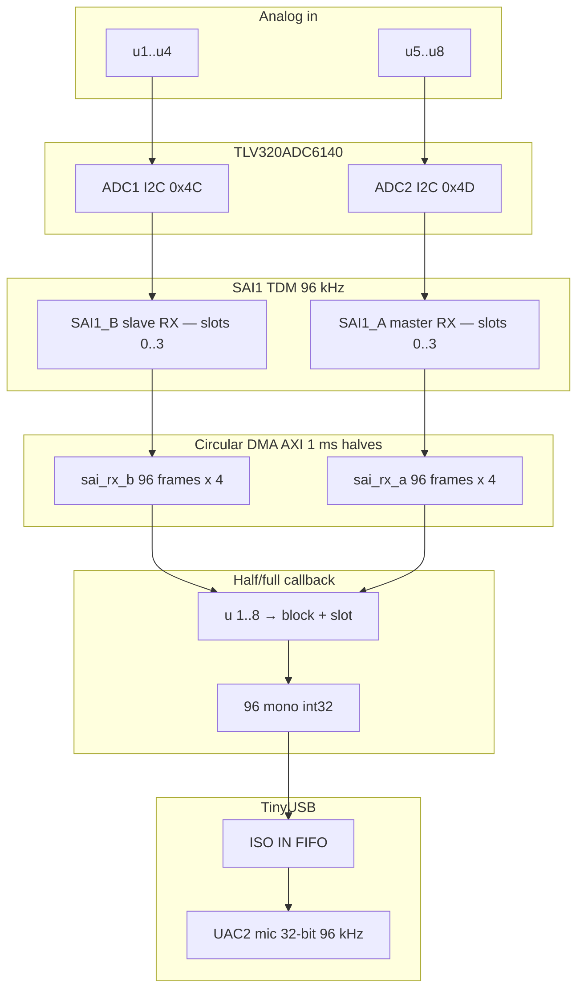
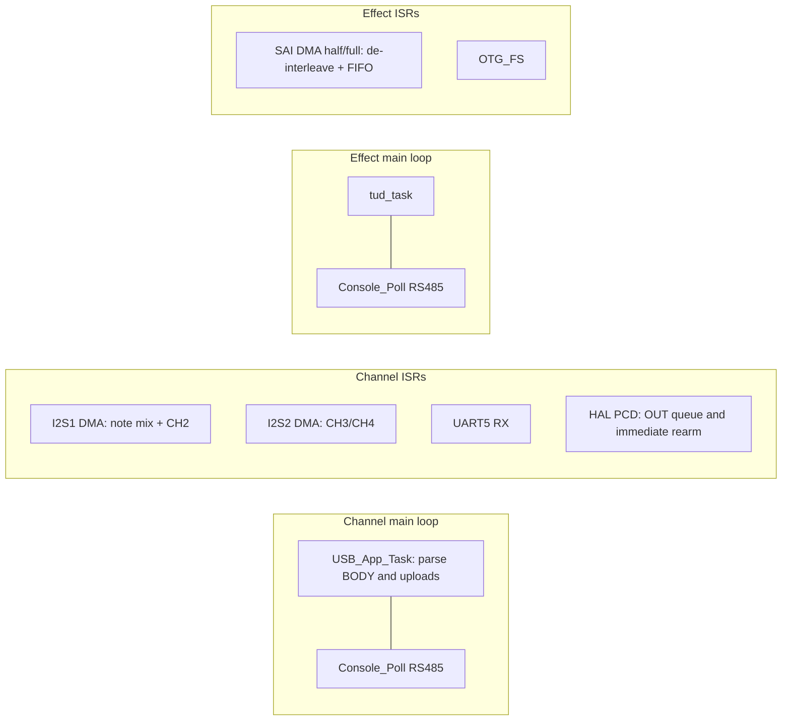

# Card data flow

Firmware signal paths for the Channel and Effect cards, including
USB/RS485, DMA, and the analog blocks the MCU only steers. Analog
switch polarity and the Channel wet/dry photo are in
[`channel_card_audio_flow.jpg`](channel_card_audio_flow.jpg) and the
Channel card README.

If this document and the firmware disagree, trust the firmware.

## 1. Host interfaces (both cards)

One RS485 multi-drop bus (`c:` / `e:` / `*:`). USB is per-card: Channel
uses one binary Full-Speed CDC connection for BODY and uploads. RS485 `vq`
provides exact ring credit and processed-BODY acknowledgements, normally every
5 ms and as often as 1 ms for high source demand. Effect retains its Full-Speed
UAC2 microphone (mono int32 at 96 kHz) and separate CDC text console.

## 2. Channel — SAMPLE voice (one of n0..n7)

Attack and BODY are storage. The attack plays to its committed length (up to
512 samples), joining the signed-int8 BODY ring through the existing 32-sample
overlap. A note-on over RS485 arms a session before acknowledging it. The host
then sends BODY for that session over the shared binary CDC stream. The card
waits for 998 samples before dispatching the script's note-on at an audio
boundary. Upload blocks can be interleaved with BODY; no audio-class carrier
or continuous idle padding is involved.

RS485 `vq` returns a 61-byte frame containing masks, physical ring capacity,
sessions, exact free space, source demand, playback duration and the last
processed BODY sequence. Host credits subtract every unacknowledged sample,
including old sessions sharing a ring. Startup and endangered voices take
priority; within a group, fewer in-flight samples and deadlines determine order.

BODY blocks contain 1..1024 samples for one voice. Complete blocks publish through
a ring reservation; a pending-to-playing promotion during the copy preserves
valid data, while a superseded session cannot publish. Release, pitch, envelopes,
filtering and oscillator routing remain owned by the existing note/VM engine.

## 3. Channel — I2S, DAC, analog

I2S1 half-buffer is 1 ms (48 frames @ 48 kHz) in AXI `.dma_buffer`
(DMA1 cannot read DTCM). Fill runs in the I2S1 DMA half/full ISR.
I2S2 (CH3/CH4) is SPI slave TX: TIM7 clears UDR; `IOSWP` because the
board wires MOSI to SDIN2.

Switch names and polarity: Channel card README (`switches[]` in
`channel_console.c`). SCF clock is `filter_ctl` (TIM3_CH1); cutoff is
clock ÷ 100.

## 4. Effect — capture to USB

Both ADCs share BCLK/FSYNC from SAI1_A. USB Full-Speed cannot carry
eight 96 kHz/32-bit channels; `u 1..8` selects one slot into the ISO IN
FIFO. SAI `FSOffset = SAI_FS_BEFOREFIRSTBIT` — the TLV320 starts slot 0
one BCLK after FSYNC; without that the sign bit is the previous slot LSB.

48 V phantom enable and power-good are console/GPIO only; they are not
in the sample path.

## 5. Main-loop vs ISR (both cards)

RS485 `vq` provides the refill permission and last processed BODY sequence.
USB carries framed BODY and uploads. The Channel receive queue has 8192 bytes;
when full, the endpoint stays unarmed and NAKs until space becomes available.
The I2S/DAC clock runs independently of USB traffic. Effect retains TinyUSB.
