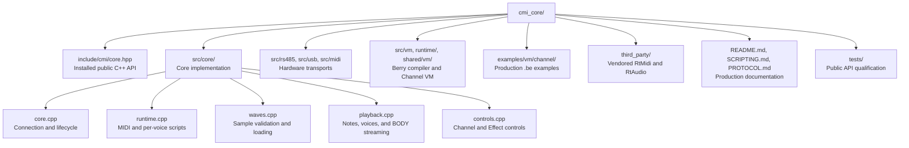
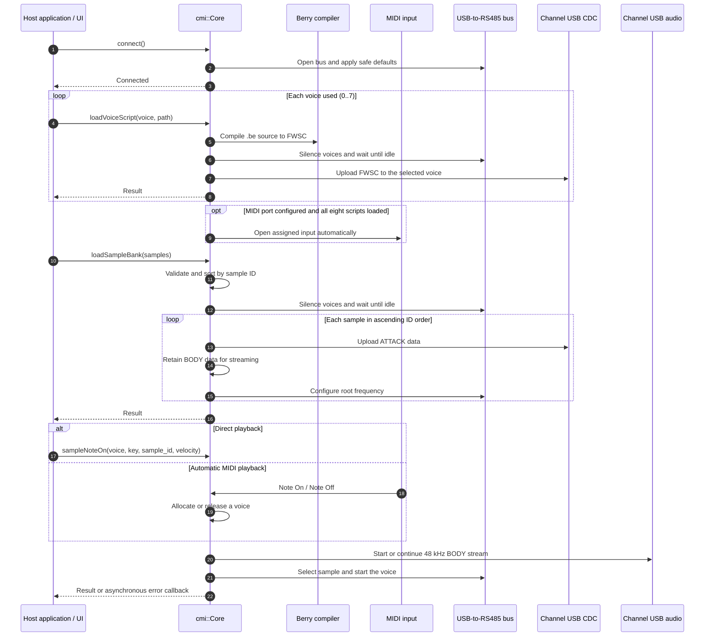

# cmi_core

`cmi_core` is the C++17 host library for a Freshwater CMI system. One
`cmi::Core` object owns card communication, Channel VM loading, sample playback,
USB BODY streaming, MIDI input, voice allocation, and the supported Effect Card
controls.

## Documentation

The three top-level documents in this folder are the complete entry points:

- [README.md](README.md) — host library setup, API, samples, playback, and controls.
- [SCRIPTING.md](SCRIPTING.md) — Channel Berry language, handlers, functions, limits, and examples.
- [PROTOCOL.md](PROTOCOL.md) — complete Channel and Effect Card RS485/USB wire protocol and command reference.

## Package structure



Only `include/cmi/core.hpp` is the application-facing header. The remaining
directories implement the library, contain its required dependencies, or
provide production documentation and qualification.

## Startup and playback flow



Scripts are owned by individual voices. Samples are shared card-wide assets;
the note operation selects which sample ID a programmed voice plays.

## Build and link

The source package contains its required Berry, RtMidi, and RtAudio sources.
It does not download dependencies while configuring.

```cmake
add_subdirectory(path/to/cmi_core)
target_link_libraries(your_app PRIVATE cmi::core)
```

An installed package can be consumed with:

```cmake
find_package(cmi_core CONFIG REQUIRED)
target_link_libraries(your_app PRIVATE cmi::core)
```

The host still requires the normal platform audio and MIDI services and the
drivers for the Channel Card and USB-to-RS485 adapter.

## Connect

```cpp
#include <cmi/core.hpp>

#include <iostream>

int main()
{
  cmi::CoreParams params;
  params.rs485_port = "/dev/cu.usbserial-0001";
  params.channel_cdc_port = "/dev/cu.usbmodemCHCARD_0123456789ABCDEF012345673";
  params.midi_port = "Launchkey MIDI Out"; // Empty disables MIDI.

  cmi::Core core(params);
  core.setErrorHandler([](const cmi::Result &error) {
    std::cerr << error.message << '\n';
  });

  const cmi::Result connected = core.connect();
  if (!connected) {
    std::cerr << connected.message << '\n';
    return 1;
  }

  for (uint8_t voice = 0; voice < 8; ++voice) {
    const cmi::Result loaded =
        core.loadVoiceScript(voice, "channel.be");
    if (!loaded) {
      std::cerr << loaded.message << '\n';
      return 1;
    }
  }

  cmi::SampleDefinition sample;
  sample.id = 60;
  sample.sample_file = "piano_c4.wav";
  sample.root_hz = 261.625565;
  if (!core.loadSample(sample)) {
    return 1;
  }

  const cmi::Result started = core.sampleNoteOn(0, 60, sample.id);
  if (!started) {
    std::cerr << started.message << '\n';
  }
  (void)core.noteOff(0);
  (void)core.disconnect();
}
```

`rs485_port` and `channel_cdc_port` are required. The Effect Card shares the
RS485 connection. `channel_audio_device` may select an exact USB audio-device
name; when empty, the library selects the first compatible Channel Card device.

Use `cmi::Core::listMidiPorts()` to obtain names accepted by `midi_port`. When a
port is assigned, MIDI opens automatically after all eight Channel voice
programs are loaded. MIDI uses the loaded sample map and supports Note On, Note
Off, velocity-zero Note Off, and controllers 120/123 for all-notes-off.

All direct operations wait for their card reply and return a `cmi::Result`.
Long-running calls such as `connect()`, VM upload, and sample loading should run
on the application's worker thread.

## Load a sample

A combined WAV or raw recording is the simplest input. The library converts a
WAV to mono, resamples it to 48 kHz, creates the card-resident attack, and keeps
the overlapping BODY ready for USB streaming.

```cpp
cmi::SampleDefinition piano;
piano.id = 60;
piano.sample_file = "samples/piano_c4.wav";
piano.root_hz = 261.625565;

cmi::Result loaded = core.loadSample(piano);
if (loaded) {
  loaded = core.sampleNoteOn(0, 60, piano.id);
}
```

Combined raw input is signed 8-bit. Set
`raw_sample_rate_hz` when it is not 48 kHz.

Already separated assets can be loaded instead:

```cpp
cmi::SampleDefinition piano;
piano.id = 60;
piano.attack_file = "samples/w60_piano_head.i8";
piano.body_file = "samples/w60_piano_body.i8";
piano.root_hz = 261.625565;

const cmi::Result loaded = core.loadSample(piano);
```

An attack and separate BODY are signed 8-bit PCM; BODY is at 48 kHz.
`loadSample()` validates the files,
uploads the attack, configures root pitch, and commits the BODY in the required
order. A failed load never marks the sample available for playback.

`loadSampleBank()` accepts explicit sample definitions. `loadSampleFolder()` accepts
the `wN_*_head.i8`, `wN_*_body.i8`, and optional
`roots.txt` layout.

Eight raw recordings can be loaded as one validated bank:

```cpp
const std::array<std::string, 8> files = {
    "samples/c2.raw", "samples/d2.raw", "samples/e2.raw", "samples/f2.raw",
    "samples/g2.raw", "samples/a2.raw", "samples/b2.raw", "samples/c3.raw",
};
const std::array<double, 8> roots_hz = {
    65.406391, 73.416192, 82.406889, 87.307058,
    97.998859, 110.0, 123.470825, 130.812783,
};

std::vector<cmi::SampleDefinition> bank;
for (uint16_t id = 0; id < files.size(); ++id) {
  cmi::SampleDefinition sample;
  sample.id = id;
  sample.sample_file = files[id];
  sample.raw_sample_rate_hz = 48000;
  sample.root_hz = roots_hz[id];
  bank.push_back(sample);
}

const cmi::Result loaded = core.loadSampleBank(bank);
```

Samples are card-wide assets identified by IDs `0..255`; they do not belong to a
specific voice. `sampleNoteOn(voice, key, sample_id, velocity)` selects a loaded
sample when starting that voice. Velocity defaults to 127 when omitted and is
passed to `on_note_on(key, velocity)`. Sample files are therefore loaded
explicitly after `connect()`, never through `CoreParams`.

MIDI key `N` selects sample ID `N` by default. Load those samples before use;
`setMidiSampleMap()` replaces that mapping.

## Channel controls

The public API provides sample note playback, all-notes-off,
output attenuation, per-voice or global low-pass filters,
filter pitch tracking, Channel voice status, and bus recovery.

Each Channel voice has its own VM program slot. After connecting, call
`loadVoiceScript(voice, path)` or `loadVoiceScriptSource(voice, source)` for
every voice the application will address. Direct note calls require only the
selected voice to have a program. Automatic MIDI input starts after all eight
slots are loaded. `loadedProgramMask()` reports the slots loaded through this
`Core`.

See [Channel scripting](SCRIPTING.md) for the complete handler, function,
input, state, runtime-limit, and example reference.

## Effect controls

The Effect Card API is limited to the controls used by the finished
application:

- `queryEffectStatus()`
- `setPhantomPower()`
- `setEffectAudioEnabled()`

The Channel Card remains usable when no Effect Card is attached. Calls to an
absent Effect Card return the normal timeout result.
