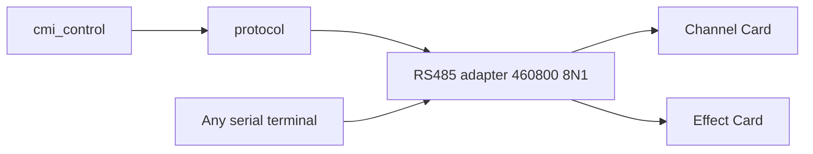

# RS485 Console — Architecture

Half-duplex, multi-drop RS485 console on Channel and Effect Card firmware,
plus optional PC tools that speak the **same ASCII protocol** any serial
terminal can type (`screen`, `minicom`, PuTTY at **460800 8N1**).

## Shipping model

| Artifact                                            | Role                                                      | Required?      |
| --------------------------------------------------- | --------------------------------------------------------- | -------------- |
| Channel / Effect firmware                           | Product protocol (addressing, commands, `ok`/`err`)       | Yes            |
| USB↔RS485 adapter + any terminal                    | Maintenance / bring-up                                    | Enough for lab |
| [`cmi_control`](../../cmi_control)           | Supported example: MIDI + full console + preview scope   | No             |
| [`protocol`](../../protocol) | C++17 host SDK: wire API, serial/RS485, USB, MIDI, audio | Host apps |

**Implication:** do not invent framing a terminal cannot type. Voice commands
are ASCII (`c:n3 440` + Enter). Compact `[C]ok` replies stay human-readable.

## Physical bus

One shared D+/D- multi-drop bus. Operators:

| Operator                                 | Role                     |
| ---------------------------------------- | ------------------------ |
| Rockchip CPU card (future) / host SDK app | Production voice/control |
| PC + terminal                            | Maintenance              |

Addresses: `c:` Channel, `e:` Effect, `*:` / bare = broadcast.

## Wire contract

| Direction   | Rule                                                                                               |
| ----------- | -------------------------------------------------------------------------------------------------- |
| Host → card | One ASCII line, optional `c:`/`e:`/`*:`, **single `\r`** (never `\r\n` — dual EOL double-executes) |
| Card → host | One terminal reply: `[C]` or `[E]` + body + **`\r\n`**                                             |
| Success     | `[C]ok\r\n` / `[E]ok\r\n` (compact)                                                                |
| Failure     | `[C]err:<code>\r\n` — `syntax`, `range`, `unknown`, `rxdrop`, …                                    |

### Voice dialect (MIDI / realtime)

**Fractional Hz** (ASCII `double`); never integer-round pitch — that breaks
equal-temperament octaves (e.g. C4→262 / C5→523 → ~1 Hz beat). On-card
default scale **0.125** when `[scale]` omitted.

| Intent   | Example TX          | ACK         |
| -------- | ------------------- | ----------- |
| Note on  | `c:n3 261.625565\r` | `[C]ok\r\n` |
| Note off | `c:n3 0\r`          | `[C]ok\r\n` |
| Silence  | `c:n 0\r`           | `[C]ok\r\n` |
| Gain     | `c:g 1 6\r`         | `[C]ok\r\n` |

Host keeps the 8-slot **VoiceBank**; the card only receives per-slot `nX`.
ASCII only — the old binary bank frame (`c:` + magic `0x01` + `uint16` Hz)
has been removed.

### Echo (Effect)

`e:ec 0` / `e:ec 1` — runtime keystroke bus echo (firmware default
**off**). Production and burst TX require echo off. With device echo off,
enable **local** echo in the terminal. Any client can type `e:ec 0`
(including `cmi_control`).

### Half-duplex

- **Single-master (PC host):** host is the lock — one command in
  flight, wait for `[C]ok` / timeout, then next. Do not Link-resend into
  a live ACK (card DE high ⇒ RX deaf ⇒ death spiral of `no cok` on Offs).
- Cards: acquire DE, one short TX, release; never drop the ACK. (PC USB
  adapter DE is not on `RS485_CTL` — cards cannot see host TX via CTL.)
- Host: write → drain → wait for tagged line; MIDI uses tiny `idle_gap`
  and `post_ack_settle_ms = 0`. On miss: RX-idle before Link retry, then
  fail-stop. Operators: `e:ec 0` / `--echo-off`.
- Channel note-bank must keep the I2S DMA refill inside its half-buffer
  deadline (enable I-cache); otherwise the main loop starves and the
  console goes deaf under polyphony.

### Strict ACK / errors

Every command waits for a tagged reply. Host status: `Ok`, `Err`, `Timeout`,
`IoError`, `BadReply`. Retry only on Timeout/BadReply; never on `Err`. Never
block forever. Session bootstrap aborts if required steps fail.

## On-MCU (Channel)

[`channel_console.c`](../../channel_card/Core/Src/console/channel_console.c): UART5
IRQ RX, DE/RE turnaround, `Console_Poll` / `Console_Exec`, compact replies.
Same command set over USB CDC (no `[C]` tag on CDC).

## Host library

[`protocol`](../../protocol) contains the
`cardproto` wire API (`Format*`, `ParseReplyBody`, typed clients), shared
`SerialPort`, `cardlink::rs485` tagged `Link` / `Bus`, `cardlink::usb`,
`cardlink::midi`, and `cardlink::audio`. `cmi_control` is its supported
example application.

## Command reference

Wire protocol (framing, addresses, commands, replies):
[`protocol.md`](../protocol.md).

Live `h` / `help` / `?` on each card is authoritative if docs drift.
This architecture note owns bus turnaround and shipping layout.
