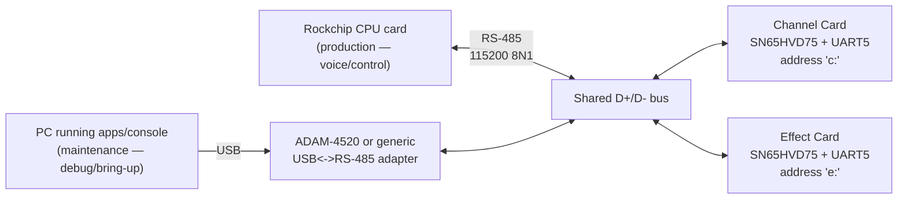
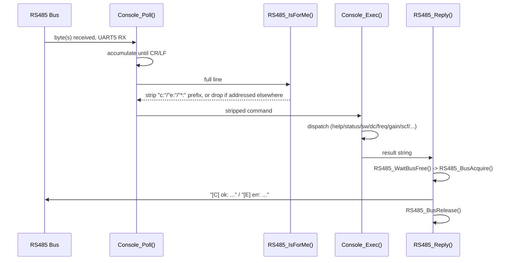
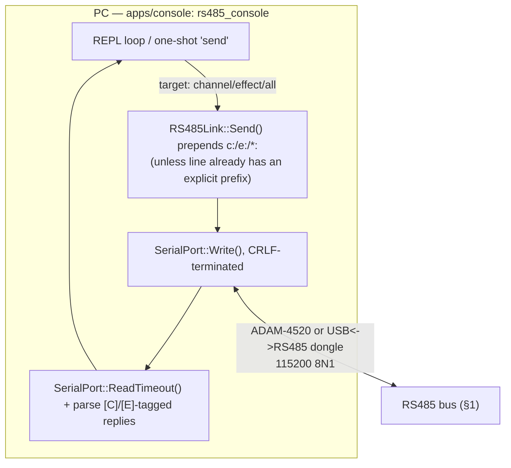

# RS485 Console — Architecture

This documents the **half-duplex, multi-drop RS485 console** on both the
Channel Card and Effect Card firmware, plus the standalone PC-side tool
(`apps/console`) that talks to it purely over the RS485 bus — through an
ADAM-4520, or a generic USB↔RS-485 dongle — with **no dependency on either
board's USB CDC connection** (that's the requirement this tool exists to
satisfy: the boards must be operable with USB entirely unplugged, RS485
only).

Status: both sides are **implemented and shipped** — on-MCU side (see
source references in §2) and the PC-side tool (§3, `apps/console`,
wrapped by `fw rs485`). The real RS485↔PC adapter model wasn't connected
yet as of this writing; the tool was verified against a mock firmware
responder over a virtual serial pair instead (see `apps/console/README.md`)
and is adapter-agnostic (`--list`/`--manual-rts`) for that reason.

## 1. Physical bus

**This is one bus with two different operators, not two separate
designs.** Per the Channel Card User Manual (FW-UM-101 §3, System
Overview): "A system controller (the CPU card, Rockchip-based) performs
voice allocation and commands the cards. RS-485 carries the real-time voice
and control traffic; USB carries bulk data such as sample uploads... All
cards also share a multi-drop RS-485 maintenance console... Both transports
accept the same command set." So the exact same wire, protocol, and
firmware parser serve two roles:

| Operator | When | Role |
|---|---|---|
| **Rockchip CPU card** | Normal running instrument | **Production** bus master — issues real-time voice/control commands (`dc`, `sw`, `gain`, `tone1`, ...) to every Channel/Effect Card during live operation |
| **PC via ADAM-4520 (or direct USB CDC)** | Development / bring-up / debugging | **Maintenance** access to the identical console, used manually |

Because both are just RS485 bus masters speaking the same addressed
protocol, nothing on the Channel/Effect Card firmware needs to change to
support the CPU card later — it will issue `c:tone1 440` the same way a
human types it today.

All bus participants' transceivers, DE/RE control pins, and UART TX lines
are wired in parallel on the same 2-wire bus — a true multi-drop network.
Only one transmitter may drive the bus at a time (half-duplex), so every
participant — the CPU card, the PC-side `apps/console` tool (via its RS485
adapter), and both MCU firmwares — must implement the same
collision-avoidance discipline (bus-free check before transmitting; see §2
for how the Channel/Effect Card firmware does this, §3 for the host side).

## 2. On-MCU software (existing, as-built)

Identical design on both cards; only the address tag (`c`/`e`) and the
switch/DC/gain command set differ.

Key implementation details (Channel Card; Effect Card mirrors this):

- **Bus turnaround** — `RS485_BusAcquire()` / `RS485_BusRelease()` in
  `apps/channel_card/Core/Src/main.c` tri-state the shared DE control pin
  (`RS485_CTL`) and the UART TX pin between transmissions, since both MCUs'
  pins are wired in parallel. Idle: DE is an input pulled low externally,
  TX is an input pulled up (keeps the bus at mark). Transmit: TX switches to
  UART alternate-function, DE is driven high, both released afterward.
- **Collision avoidance** — `RS485_WaitBusFree(timeout_ms)` polls the DE line
  (which reflects whoever is currently driving) before acquiring the bus;
  a busy bus within the timeout drops the reply rather than colliding.
- **Addressing** — `RS485_IsForMe()` checks for an `"X:"` prefix: `c:` /
  `e:` targets one card, `*:` or no prefix is broadcast (backward compatible
  with single-card testing).
- **Shared parser** — the exact same `Console_Exec()` function serves both
  transports. USB CDC commands go through `Console_ExecFromUSB()`, which
  routes replies back over USB (`console_via_usb` flag) instead of the bus.
- **Non-blocking** — `Console_Poll()` drains one byte per main-loop
  iteration; no blocking reads anywhere in the loop.

This is already documented at a glance in the top-level
[`README.md`](../README.md) §6 and per-card in
[`apps/channel_card/README.md`](../apps/channel_card/README.md) /
[`apps/effect_card/README.md`](../apps/effect_card/README.md).

## 3. PC-side console tool (`apps/console`, implemented)

This is the **maintenance** path only (see §1's operator table) — a
human-facing alternative to the Rockchip CPU card's production traffic on
the same bus, for use when the CPU card isn't driving the bus (bring-up,
bench debugging, or testing a card in isolation). The CPU card's own RS-485
firmware is out of scope for this doc/repo.

Built as a standalone C++17 CMake project — [`apps/console`](../apps/console)
— with no external dependencies, so it builds and runs on macOS, Linux and
Windows from one tree. It talks to the bus **directly**, bypassing both
boards' USB CDC entirely; the only USB link involved is the PC↔adapter one,
which isn't the boards' USB CDC and can be a totally different cable/port.
Usually driven through `fw rs485 ...` (see the top-level
[`README.md`](../README.md) §6), or directly as `apps/console/build/rs485_console`.

Design notes (implementation in `apps/console/src/`):

- **`serial_port.hpp`** abstracts the OS-level port (Open/Write/ReadTimeout/
  ListPorts) behind one interface with two backends selected by
  `CMakeLists.txt`: `serial_port_posix.cpp` (termios, macOS/Linux) and
  `serial_port_win32.cpp` (Win32 comm API, Windows — written to spec, not
  yet hardware-verified). Most adapters (ADAM-4520 and modern USB-RS485
  dongles) auto-direction, needing **no manual RTS/DE handling** — that's
  the default; `--manual-rts` is an opt-in fallback for dongles that need
  RTS toggled around each transmit, unlike the firmware side, which must
  manage DE itself because both MCUs share one transceiver pair.
- **`rs485_link.hpp`/`.cpp`** owns the wire protocol: `RS485Link::Send()`
  prepends the current default target's `c:`/`e:`/`*:` prefix unless the
  typed line already has an explicit one (mirrors `RS485_IsForMe()`'s
  "X:" check on the firmware side) and CRLF-terminates every line.
- **Default target** (`card channel` / `card effect` / `card all` in the
  REPL, or `--target` on the command line) lets the operator avoid
  retyping `c:`/`e:` on every line.
- **Reply parsing** highlights the `[C]`/`[E]` tag (color, when stdout is
  a TTY) so it's obvious which card answered a broadcast command.
- **Timeout + retry** (`--timeout-ms`, `--retries`) mirrors
  `RS485_WaitBusFree()` on the firmware side: since it's a shared,
  collision-avoided bus, a lack of reply within a short window is treated
  as "busy, retry" (bounded by `--retries`) rather than "no response."
- Verified end-to-end (REPL, one-shot send, target switching, explicit
  prefix override, no-reply/retry path) against a mock firmware responder
  over a `socat` virtual serial pair — the real adapter wasn't connected
  when this was built, so `--list`/`--manual-rts` keep the tool
  adapter-agnostic until it is.

## 4. Command reference

See the live `help` output on either transport, or the per-card README
console tables — this doc intentionally does not duplicate the command list
to avoid drift; only the two READMEs are the source of truth for the
command set.
