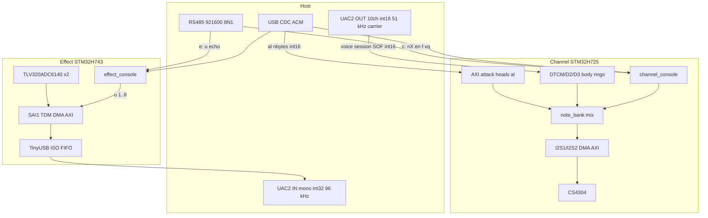
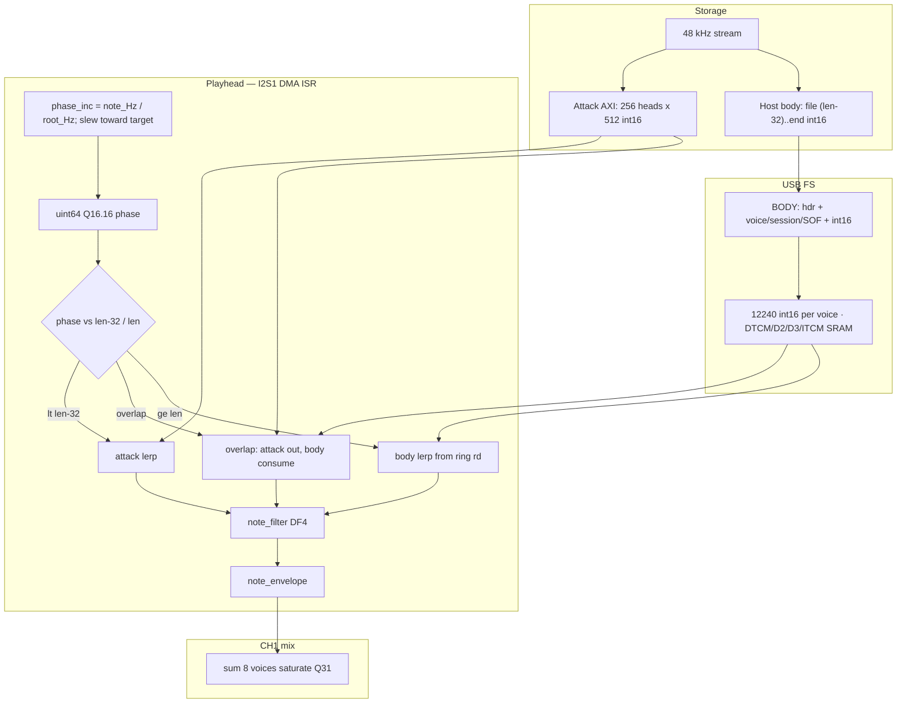
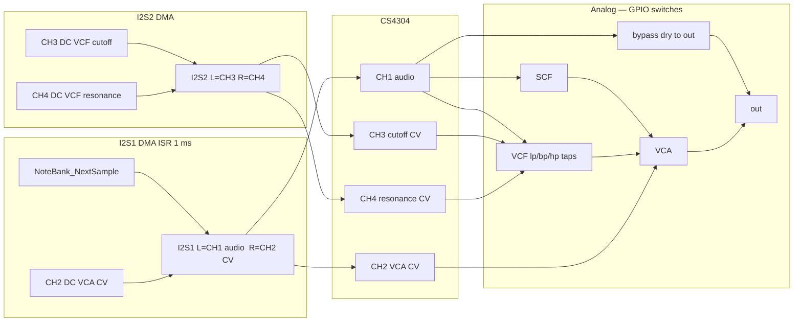
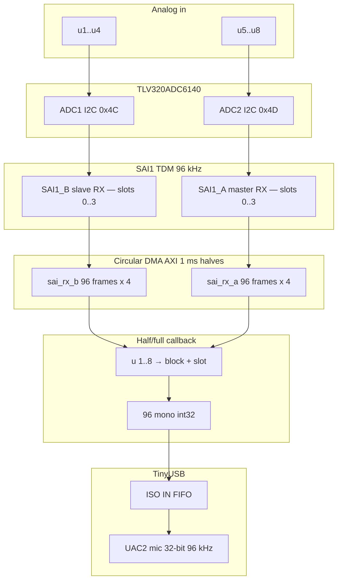
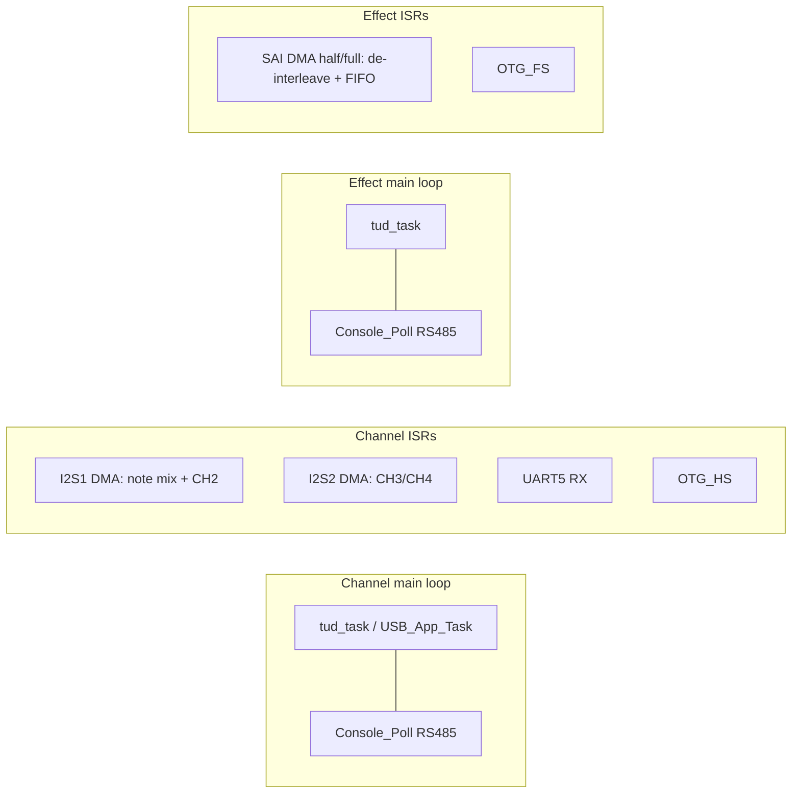

# Card data flow

Firmware signal paths for the Channel and Effect cards, including
USB/RS485, DMA, and the analog blocks the MCU only steers. Analog
switch polarity and the Channel wet/dry photo are in
[`channel_card_audio_flow.jpg`](channel_card_audio_flow.jpg) and the
Channel card README.

If this document and the firmware disagree, trust the firmware.

## 1. Host interfaces (both cards)

One RS485 multi-drop bus (`c:` / `e:` / `*:`). USB is per-card: Channel
is Full-Speed **UAC2 BODY OUT** (10-channel signed int16 carrier at 51 kHz,
1020 B / 1 ms; BODY/DAC remain 48 kHz) plus CDC. Sequential
RS485 `vq` request/reply cycles every 5 ms provide exact refill credit and PACK ack;
Effect is a Full-Speed **UAC2 microphone** (mono int32 @ 96 kHz) plus CDC.

## 2. Channel — SAMPLE voice (one of n0..n7)

Attack and body are storage. The head plays to its committed length
(≤ 512). Body is a FIFO from packed UAC2 BODY data, consumed with
Q16.16 interpolation. `nX > 0` is always a note-on. A new BODY session
(`SOF` + session 0–6) starts a new body FIFO; a repeated burst with
the same session does not.
The host packs the hungriest wanting voices into each UAC window (fair share
of a 4762-sample 10 ms OUT budget for eight voices, weighted by source-consumption
rate). Each PACK is capped at eight milliseconds of predicted source demand.
Every fresh RS485 `vq` exact free-space grant permits one bounded packed
refill; otherwise the host waits for the next reply. There is no refill before
permission: `nX` starts the attack immediately and the next `vq` permits the
first SOF PACK.
Iso OUT has no NAK. A primed BODY underrun increments `hold` but never disables
USB, RS485, or audio; a later authorized refill can recover. A full ring drops
the whole chunk; the producer never overwrites unread FIFO samples.

RS485 `vq` returns a 26-byte binary frame containing active mask, hungriest
voice, eight exact uint16 free-sample counts, and the last USB PACK sequence
already reflected by those counts. It is the only live refill authority;
USB carries BODY PACKs OUT and does not publish status.
Need-score is remaining play time: `filled / max(phase_inc, target_inc)`.
The host shares one PACK by the wanting voices' source-consumption rates.
At most one new logical PACK (or retry of the same unacknowledged PACK) follows
each fresh `vq`; its complete CRC-protected wire image is ≤ 10200 B inside the
continuous 16-bit UAC stream.
Up to three sequence-ordered PACKs may await acknowledgement; their samples
are all subtracted from later exact-credit replies, so this keeps UAC busy
without reusing any `vq` permission.
Each voice is bounded by its exact safe free-space credit.
`nX` starts immediately. The attack plays to its committed length;
body consume starts at `len − 32` with the same source fraction. The
first requested-gate `vq` permits the SOF BODY burst; further bursts require
fresh status too. `nX` retires the old ring and arms consumption; SOF installs
the new BODY session but never starts or restarts the note. The host fills
the body FIFO, then holds
the file cursor until the playhead reaches the join — dropped USB must
not skip ahead in the wav.

Voices with no loaded attack head play body from the FIFO immediately.
`en` / `f` / `fk` still apply.

## 3. Channel — I2S, DAC, analog

I2S1 half-buffer is 1 ms (48 frames @ 48 kHz) in AXI `.dma_buffer`
(DMA1 cannot read DTCM). Fill runs in the I2S1 DMA half/full ISR.
I2S2 (CH3/CH4) is SPI slave TX: TIM7 clears UDR; `IOSWP` because the
board wires MOSI to SDIN2.

Switch names and polarity: Channel card README (`switches[]` in
`channel_console.c`). SCF clock is `filter_ctl` (TIM3_CH1); cutoff is
clock ÷ 100.

## 4. Effect — capture to USB

Both ADCs share BCLK/FSYNC from SAI1_A. USB Full-Speed cannot carry
eight 96 kHz/32-bit channels; `u 1..8` selects one slot into the ISO IN
FIFO. SAI `FSOffset = SAI_FS_BEFOREFIRSTBIT` — the TLV320 starts slot 0
one BCLK after FSYNC; without that the sign bit is the previous slot LSB.

48 V phantom enable and power-good are console/GPIO only; they are not
in the sample path.

## 5. Main-loop vs ISR (both cards)

Continuous RS485 `vq` request/reply cycles provide the sole refill permission
and report the last applied USB PACK sequence. USB carries BODY data only.
A full vendor FIFO NAKs the host.
